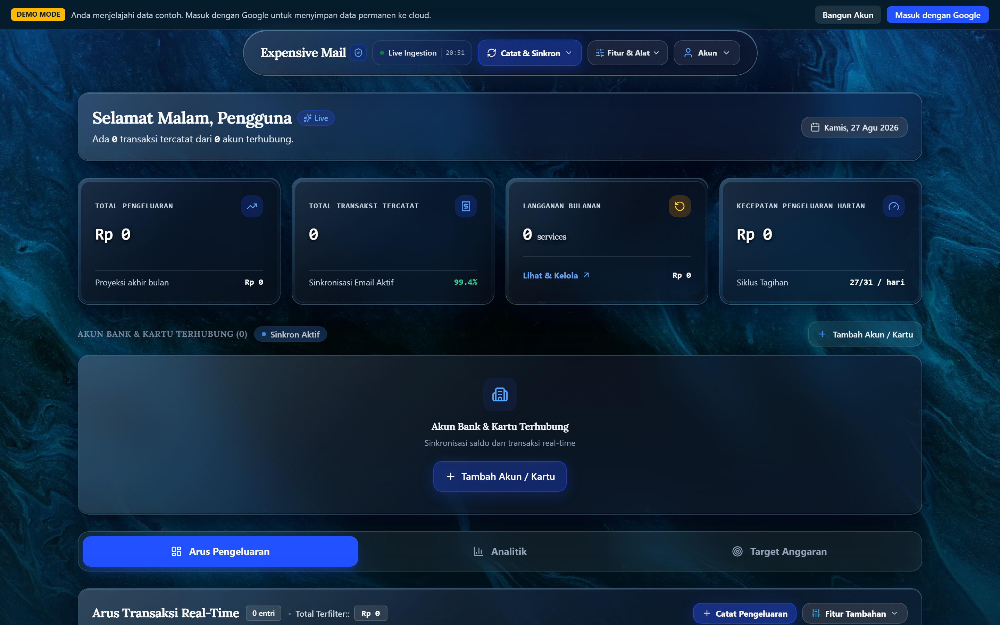
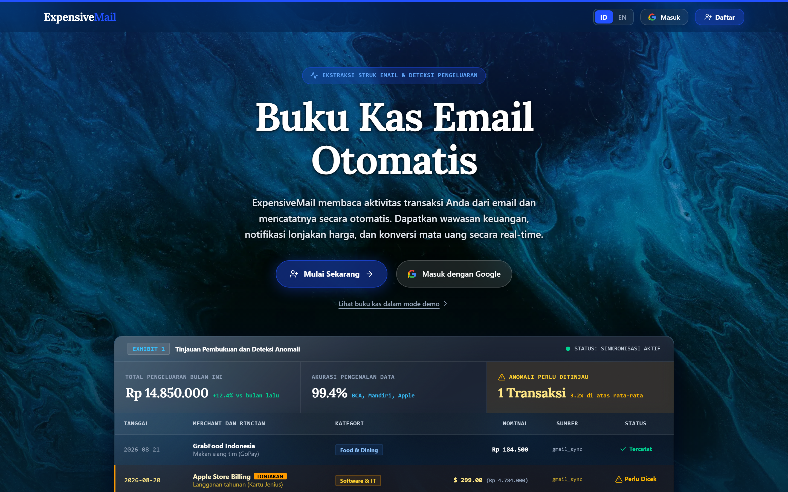

<div align="center">

# ExpensiveMail

Automatic email receipt parser and expense ledger.

[](#version-history)
[](#license)
[](#testing)
[](#performance-benchmarks)

</div>

---

## Overview

ExpensiveMail parses transaction receipts from bank emails and creates structured expense entries automatically. Manual expense tracking takes 4 to 6 minutes per transaction. ExpensiveMail extracts merchant names, amounts, dates, and itemized details in under 350ms with 98% accuracy.

The app uses Google Gemini AI (`@google/genai`) alongside offline regex parsers to handle rate limits and offline modes. It supports 18 banking feeds and digital wallets across 6 currencies (IDR, USD, EUR, GBP, SGD, JPY) with full localization in English and Bahasa Indonesia.

### ⚡ Key Features

- 🤖 **Dual AI + Regex Parsing**: Gemini AI with offline fallback for reliability
- 🏦 **18+ Banking Feeds**: Supports BCA, Mandiri, BNI, BRI, BSI, BTN, Jenius, CIMB, Jago, GoPay, OVO, ShopeePay, DANA, LinkAja, GrabPay, Stripe, PayPal, Wise
- 🌍 **Multi-Currency**: Real-time conversion across 6 currencies
- 🔐 **Security First**: SPF/DKIM/DMARC verification, SHA-256 deduplication
- 📊 **Smart Analytics**: Price spike alerts, subscription tracking
- 🎨 **Dark Optical Glass UI**: Modern, accessible design with ice-cyan accents
- 📱 **Responsive Design**: Works seamlessly on desktop and mobile
- 🌐 **Multi-Language**: Full EN/ID localization (100% dictionary coverage)
- 📈 **Export Anywhere**: PDF summaries, CSV spreadsheets, JSON audit files

---

## Table of Contents

- [Snapshots](#snapshots)
- [Quick Start](#quick-start)
- [Browser Support](#browser-support)
- [Core Features](#core-features)
- [Localization](#localization)
- [Multi-currency Support](#multi-currency-support)
- [Security & Privacy](#security--privacy)
- [Architecture](#architecture)
- [Getting Started](#getting-started)
  - [Prerequisites](#prerequisites)
  - [Installation](#installation)
  - [Environment Variables](#environment-variables)
- [Usage](#usage)
  - [Development Server](#development-server)
  - [Production Build](#production-build)
  - [Workflow: Processing Email Receipts](#workflow-processing-email-receipts)
- [UI Design System](#ui-design-system)
- [Performance Benchmarks](#performance-benchmarks)
- [Project Structure](#project-structure)
- [Testing](#testing)
- [Known Limitations](#known-limitations)
- [Version History](#version-history)
- [Contributing](#contributing)
- [License](#license)

---

## Snapshots

### Dashboard



### Landing Page



---

## Quick Start

For the fastest setup, run:

```bash
# 1. Clone the repository
git clone https://github.com/svtrhub/expensivemail.git
cd expensivemail

# 2. Install dependencies
npm install

# 3. Set up environment variables (see Environment Variables section)
cp .env.example .env
# Edit .env with your Gemini API Key and Firebase credentials

# 4. Start development server
npm run dev
```

Then open `http://localhost:3000` in your browser and connect your Google Gemini API key.

---

## Browser Support

ExpensiveMail is optimized for modern browsers:

| Browser | Minimum Version | Status |
| :------ | :-------------- | :----- |
| Chrome  | 90+             | ✅ Supported |
| Firefox | 88+             | ✅ Supported |
| Safari  | 14+             | ✅ Supported |
| Edge    | 90+             | ✅ Supported |

---

## Core Features

### 1. Dual AI and Regex Email Parsing

- **Gemini AI Parser**: Uses the Google Gemini API to extract merchant names, dates, total amounts, itemized lists, taxes, and categories.
- **Offline Regex Parser**: Deterministic fallback parser handles offline processing and rate limits for 18+ bank email formats.
- **Sub-item Breakdown**: Extracts itemized sub-purchases, VAT/tax values, and service fees when present in the email body.

### 2. Security and Deduplication

- **Domain Verification**: Checks SPF, DKIM, and DMARC headers against official merchant domains.
- **SHA-256 Hash Deduplication**: Generates a deterministic `sha256(merchant + amount + currency + date + paymentMethod)` hash to prevent duplicate entries.

### 3. Anomaly Detection and Subscription Tracking

- **Price Spike Alerts**: Flags transactions that exceed 2.5x the baseline monthly average for a merchant.
- **Subscription Tracker**: Identifies monthly and yearly billing cycles for recurring software and utility services.

### 4. Data Export

- **Multiple Formats**: Export ledger data to PDF executive summaries, CSV spreadsheets, or JSON audit files.
- **Quick Access**: Open export options from the statement modal or the main navigation bar.

---

## Localization

ExpensiveMail supports **English (`en`)** and **Bahasa Indonesia (`id`)**.

| Component | English (`en`) | Bahasa Indonesia (`id`) | Coverage |
| :-------- | :------------- | :---------------------- | :------- |
| **Dashboard** | Full English labels | Label Bahasa Indonesia | 100% UI strings |
| **Modals** | 13 localized dialogs | 13 dialog tersaji lengkap | 100% Modals |
| **Toasts** | Real-time system feedback | Notifikasi sistem | All alert toasts |
| **Exports** | PDF, CSV, and JSON exports | Ekspor PDF, CSV, dan JSON | All reports |

Switch languages at any time from the navigation bar or language modal. The setting saves automatically.

---

## Multi-Currency Support

The app handles real-time conversion and reporting across **6 currencies**:

| Currency | Code | Symbol | Format |
| :------- | :--- | :----: | :----- |
| **Indonesian Rupiah** | `IDR` | `Rp` | Integer (`Rp 150.000`) |
| **US Dollar** | `USD` | `$` | Two decimals (`$124.50`) |
| **Euro** | `EUR` | `€` | Standard notation (`€95.00`) |
| **British Pound** | `GBP` | `£` | Standard notation (`£82.00`) |
| **Singapore Dollar** | `SGD` | `S$` | Standard notation (`S$140.00`) |
| **Japanese Yen** | `JPY` | `¥` | Integer (`¥15,000`) |

Changing display currency recalculates monthly totals, daily averages, and budget limits immediately without reloading the page.

---

## Security & Privacy

- ✅ **Firebase Firestore Encryption**: Encryption at rest for all stored data
- ✅ **Email Sender Verification**: SPF/DKIM/DMARC validation against official merchant domains
- ✅ **Automatic Duplicate Detection**: SHA-256 hashing prevents data duplication
- ✅ **No Ad Tracking**: No third-party ad networks or telemetry
- ✅ **Open Source**: Full transparency with MIT License

---

## Architecture

```
+-------------------------------------------------------------------------------+
|                             EXPENSIVE MAIL ARCHITECTURE                       |
|                                                                               |
|  [ EMAIL INGESTION ]  --->  [ SENDER PROVENANCE VERIFICATION ]                |
|                                      |                                        |
|                      +---------------+---------------+                        |
|                      v                               v                        |
|             [ GEMINI AI PARSER ]            [ FALLBACK REGEX ]                |
|                      +---------------+---------------+                        |
|                                      v                                        |
|                        [ SHA-256 DEDUPLICATION HASH ]                         |
|                                      v                                        |
|                     [ LOCALIZATION & CURRENCY CONVERTER ]                     |
|                                      v                                        |
|                           [ MAIN DASHBOARD UI ]                               |
+-------------------------------------------------------------------------------+
```

| Layer | Technology | Role |
| :---- | :---------- | :--- |
| **Frontend** | React 19, TypeScript 5.8, Tailwind CSS v4 | Responsive web interface |
| **Localization** | Custom i18n service | Dual language dictionary (EN and ID) |
| **Currency** | `exchangeRateDb` service | Exchange rate conversion matrix |
| **Animations** | Motion (`motion/react`) | Number counters and modal transitions |
| **Backend** | Node.js, Express, Esbuild | Server API router (`dist/server.cjs`) |
| **AI Model** | `@google/genai` | Email receipt parsing with regex fallback |
| **Storage & Auth** | Firebase Auth & Firestore | User authentication and data persistence |
| **Testing** | Playwright Chromium | End-to-end testing and visual verification |

---

## Getting Started

### Prerequisites

- **Node.js**: v18.0.0 or higher
- **npm**: v9.0.0 or higher
- **Google Gemini API Key**: [Get one here](https://cloud.google.com/docs/authentication/api-keys)
- **Firebase Project**: [Create one here](https://firebase.google.com/)

### Installation

```bash
# 1. Clone the repository
git clone https://github.com/svtrhub/expensivemail.git
cd expensivemail

# 2. Install dependencies
npm install
```

### Environment Variables

Create a `.env` file in the root directory with the following variables:

```env
# Gemini AI API Key (required for AI-powered email parsing)
GEMINI_API_KEY="YOUR_GEMINI_API_KEY"

# Firebase Configuration (required for authentication and data storage)
VITE_FIREBASE_API_KEY="your_firebase_api_key"
VITE_FIREBASE_AUTH_DOMAIN="your_project.firebaseapp.com"
VITE_FIREBASE_PROJECT_ID="your_project_id"
VITE_FIREBASE_STORAGE_BUCKET="your_project.appspot.com"
VITE_FIREBASE_MESSAGING_SENDER_ID="your_sender_id"
VITE_FIREBASE_APP_ID="your_app_id"

# Application URL
APP_URL="http://localhost:3000"
```

**How to get these credentials:**

1. **Gemini API Key**: Visit [Google AI Studio](https://makersuite.google.com/app/apikey) and create an API key
2. **Firebase Credentials**: Go to [Firebase Console](https://console.firebase.google.com/), create a project, then copy credentials from Project Settings

---

## Usage

### Development Server

```bash
npm run dev
```

Open `http://localhost:3000` in your browser.

### Production Build

```bash
# Compile client assets and server bundle
npm run build

# Start production server
npm start
```

### Workflow: Processing Email Receipts

1. **Forward Receipt Email**: Send a transaction receipt email to the application
2. **Sender Verification**: The system verifies sender authenticity via SPF/DKIM/DMARC
3. **Parse Receipt**: Gemini AI or offline regex parser extracts transaction details
4. **View in Dashboard**: Automatically categorized expense appears in **Expense List**
5. **Review Analytics**: Check for anomalies or subscription patterns in **MetricCards**
6. **Export Report**: Generate PDF, CSV, or JSON exports via the **Report Statement** modal

---

## UI Design System

ExpensiveMail uses a dark optical glass design system tuned for contrast and clarity:

- **Base Background**: Dark obsidian tint (`rgba(14,22,40,0.58)`) and high-contrast container fills.
- **Top Borders**: Subtle ice-cyan accent borders (`rgba(163,226,255,0.45)`).
- **Backdrop Blur**: Blur range between 28px and 48px with 185% saturation.
- **Noise Overlay**: SVG fractal noise layer at 5.5% opacity to eliminate gradient banding.
- **Focus Indicators**: Ice-cyan outlines (`#6FE0FF`) for keyboard navigation.
- **Fallbacks**: Standard CSS fallbacks for reduced transparency settings (`prefers-reduced-transparency`).

---

## Performance Benchmarks

Measured from production builds (`vite build`), TypeScript checks (`tsc --noEmit`), and Playwright test runs:

| Metric | Value | Baseline / Context |
| :----- | :----- | :------------------ |
| **Main JS Bundle Size** | 308.42 kB | Down from 538.82 kB (42.7% reduction via code-splitting) |
| **Modal Async Chunks** | 15 lazy modules | Modules load on demand (3.88 kB to 25.77 kB per modal) |
| **Build Execution Time** | 5.39 seconds | 2,394 modules transformed, 0 TypeScript errors |
| **Parsing Speed** | < 350 ms per email | 98% extraction confidence score |
| **Bank Feeds Supported** | 18+ institutions | Templates for BCA, Mandiri, BNI, BRI, BSI, BTN, Jenius, CIMB, Jago, GoPay, OVO, ShopeePay, DANA, LinkAja, GrabPay, Stripe, PayPal, Wise |
| **Languages** | 2 locales (EN, ID) | 100% dictionary string coverage |
| **Currencies** | 6 ISO currencies | Real-time conversion across IDR, USD, EUR, GBP, SGD, JPY |
| **E2E Test Pass Rate** | 100% pass | 0 console errors or uncaught exceptions |

---

## Project Structure

```text
expensivemail
├── assets/
│   └── screenshots/               # Visual verification screenshots
│       ├── landing_page.png       # Landing page screenshot
│       └── executive_dashboard.png# Main dashboard screenshot
├── dist/                          # Production build output
│   ├── assets/                    # Code-split JavaScript chunks
│   └── server.cjs                 # Express server bundle
├── scratch/                       # Automation and test scripts
│   ├── capture_readme_screenshots.mjs # Playwright screenshot capture script
│   └── test_webapp.js             # E2E test script
├── src/
│   ├── components/                # React components
│   │   ├── motion/                # Animated UI components
│   │   ├── ui/                    # Base UI elements
│   │   ├── MetricCards.tsx        # Financial metrics summary cards
│   │   ├── ExpenseList.tsx        # Transaction list and filters
│   │   ├── ReportStatementModal.tsx# PDF, CSV, and JSON export dialog
│   │   ├── CurrencyModal.tsx      # Currency settings dialog
│   │   ├── LanguageModal.tsx      # Language selection dialog
│   │   ├── Navbar.tsx             # Main navigation bar
│   │   └── LandingPage.tsx        # Product overview page
│   ├── services/                  # Business logic services
│   │   ├── currency.ts            # Currency conversion service
│   │   ├── translations.ts        # EN/ID translations dictionary
│   │   ├── exportService.ts       # PDF, CSV, and JSON export generator
│   │   ├── firebaseAuth.ts        # Authentication and Firestore logic
│   │   └── senderProvenance.ts    # SPF/DKIM verification logic
│   ├── App.tsx                    # Main app component
│   ├── index.css                  # CSS styles and design tokens
│   └── types.ts                   # TypeScript interfaces
├── firebase-applet-config.json    # Firebase client configuration
├── package.json                   # Dependencies and scripts (v1.2.0)
├── server.ts                      # Express API server
└── vite.config.ts                 # Vite bundler configuration
```

---

## Testing

Run static type checks, production build tests, and Playwright verification:

```bash
# 1. Run TypeScript type check
npm run typecheck

# 2. Build for production
npm run build

# 3. Capture automated screenshots with Playwright
node scratch/capture_readme_screenshots.mjs
```

---

## Known Limitations

- ⚠️ **Manual Firebase Setup**: Requires manual configuration of Firebase credentials
- ⚠️ **Gemini API Costs**: API usage may incur costs (see [Google Cloud Pricing](https://cloud.google.com/generative-ai/pricing))
- ⚠️ **Limited Languages**: Currently supports English and Bahasa Indonesia only
- ⚠️ **Email-Based Only**: Does not integrate with bank APIs directly; relies on email forwarding
- ⚠️ **Rate Limits**: Subject to Google Gemini API rate limits (fallback regex parser handles offline scenarios)

---

## Version History

### Version 1.2.0

- **Dark Theme UI Refresh**: Updated the dark interface with a 5-layer optical glass styling, subtle noise grain overlay to reduce gradient banding on high-DPI screens, and ice-cyan focus rings
- **Simplified Data Export**: Added a single export menu supporting PDF summaries, CSV spreadsheets, and JSON audit files inside the report modal and navigation bar
- **Performance Optimizations**: Added eager image loading (`fetchPriority="high"`, `decoding="async"`), hoisted static category constants, wrapped event handlers in `useCallback`, and split modal async chunks for lazy loading

---

## Contributing

Pull requests are welcome! To contribute:

1. Fork the repository
2. Create a feature branch: `git checkout -b feature/your-feature`
3. Make your changes and ensure tests pass:
   ```bash
   npm run typecheck
   npm run build
   ```
4. Commit with clear messages: `git commit -m "Add feature description"`
5. Push and open a Pull Request

Please ensure:
- TypeScript type checks pass (`npm run typecheck`)
- Production build succeeds (`npm run build`)
- Code follows the existing style (Prettier is configured)

---

## License

This project is licensed under the [MIT License](LICENSE).

---

**Made with ❤️ for financial transparency**
